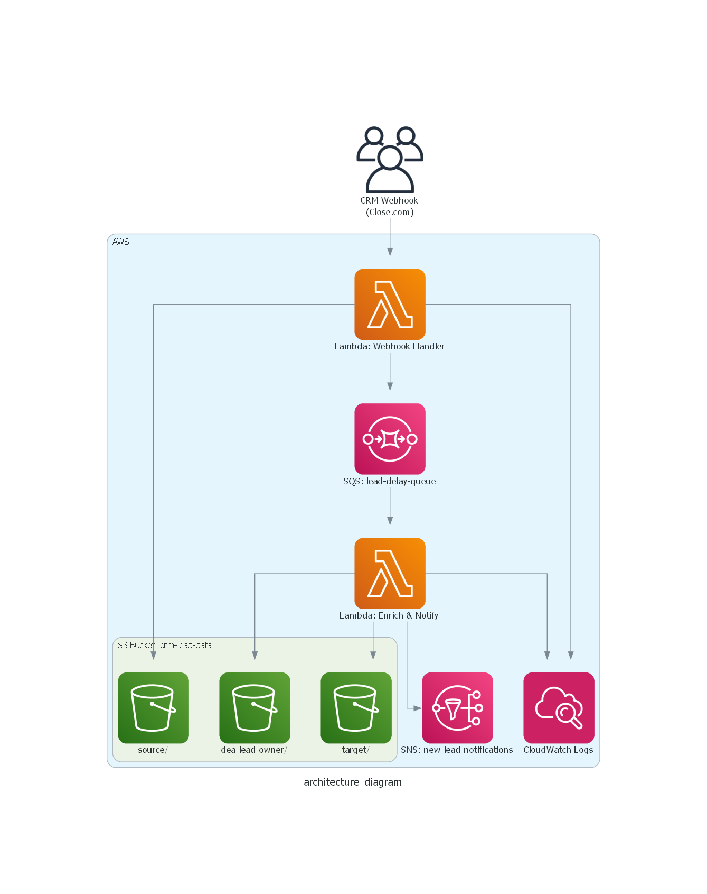

# 🧠 Real-Time CRM Lead Processing and Notification System

This project implements a real-time, serverless lead processing pipeline using AWS services and Close CRM webhooks.

## 🔧 Features

- ✅ Real-time capture of new leads from Close CRM
- ⏳ 10-minute delay buffer using SQS to allow CRM updates
- 🔍 Lookup of enriched lead owner data from S3
- 📬 Sends notifications via Amazon SNS (email or SMS)
- ☁️ Fully serverless using Lambda, S3, EventBridge, and SNS
- 🔐 Secure, credential-free architecture

## 📊 Architecture Diagram

## 🗂️ Project Structure

| Folder/File              | Description                                  |
|--------------------------|----------------------------------------------|
| `lambda/webhook_handler.py`      | Lambda 1 - Handles CRM webhook          |
| `lambda/enrich_and_notify.py`    | Lambda 2 - Processes delayed message    |
| `infrastructure/`                | Placeholder for IaC (Terraform, etc.)   |
| `architecture_diagram.py`       | Python script to generate diagram       |
| `README.md`                      | Documentation                          |

## 🚀 How It Works

1. Webhook Handler Lambda receives real-time lead data
2. Stores raw event as JSON in S3
3. Publishes a delayed message to SQS
4. Enrichment Lambda pulls from queue and merges lead owner data
5. Sends an SNS email alert or EventBridge notification

## 📬 Notification Example

📥 New Lead Alert

Name: John Smith  
Lead ID: lead_abc123  
Created Date: 2025-06-27  
Label: Potential  
Email: john.smith@example.com  
Lead Owner: Sarah Lang  
Funnel: DE ACADEMY Direct VSL

## ✅ Success Criteria

- [x] New leads are captured and stored in S3
- [x] Delay allows CRM to assign owners
- [x] Enrichment works by matching `lead_id`
- [x] Team receives notifications
- [x] Logs and DLQ handle retry/failure scenarios
